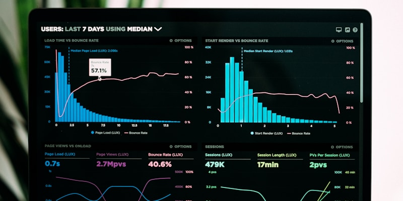
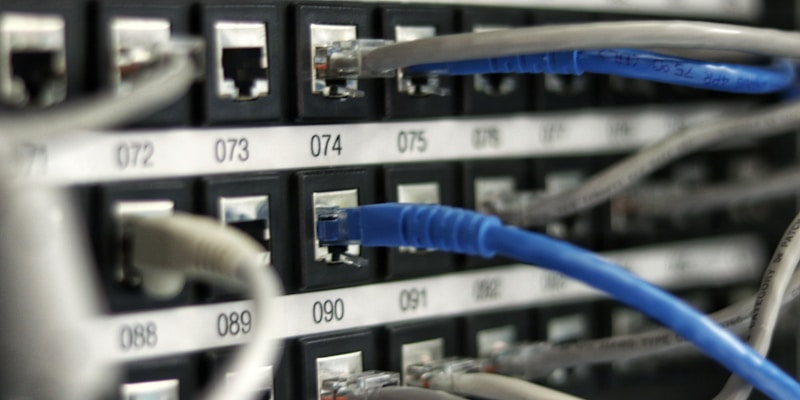

# AI 분야별 1단계 교육 과정

## 📚 1단계: 기초 단계 (Foundation Level)

### 🎯 학습 목표
- AI의 기본 개념과 원리 이해
- 머신러닝의 기초 지식 습득
- 데이터 처리의 기본 원리 파악
- 시각적 학습을 통한 직관적 이해

---

## 📊 주요 학습 영역

### 1. AI 기초 개념


**핵심 내용:**
- 인공지능의 정의와 역사
- AI vs 머신러닝 vs 딥러닝의 차이점
- AI의 현재와 미래

### 2. 머신러닝 기초


**학습 요소:**
- 지도학습 vs 비지도학습
- 분류와 회귀 문제
- 모델 평가 방법

### 3. 데이터 처리 기초


**중요 개념:**
- 데이터 전처리
- 특성 엔지니어링
- 데이터 시각화

---

## 🎨 시각적 학습 자료

### 학습 플로우 차트
```
입력 데이터 → 전처리 → 모델 학습 → 평가 → 결과
    ↓           ↓         ↓        ↓      ↓
   이미지     정규화    알고리즘   정확도   예측
```

### AI 분야별 로드맵
```
┌─────────────────┐
│   AI 1단계      │
├─────────────────┤
│ • 기초 개념     │
│ • 머신러닝      │
│ • 데이터 처리    │
│ • 시각화        │
└─────────────────┘
         ↓
┌─────────────────┐
│   AI 2단계      │
├─────────────────┤
│ • 딥러닝        │
│ • 신경망        │
│ • 고급 알고리즘  │
└─────────────────┘
         ↓
┌─────────────────┐
│   AI 3단계      │
├─────────────────┤
│ • 특화 분야     │
│ • 실무 적용     │
│ • 프로젝트      │
└─────────────────┘
```

---

## 📋 실습 프로젝트

### 1. 이미지 분류 프로젝트


**목표:** 간단한 이미지 분류 모델 만들기
- MNIST 데이터셋 활용
- 기본 분류 알고리즘 적용
- 결과 시각화

### 2. 데이터 시각화 프로젝트


**목표:** 다양한 차트와 그래프 만들기
- matplotlib, seaborn 활용
- 인사이트 도출
- 스토리텔링

---

## 🛠️ 사용 도구 및 기술

### 프로그래밍 언어
- **Python** (주요 언어)
- **R** (통계 분석)

### 라이브러리
```python
# 데이터 처리
import pandas as pd
import numpy as np

# 시각화
import matplotlib.pyplot as plt
import seaborn as sns

# 머신러닝
from sklearn.model_selection import train_test_split
from sklearn.ensemble import RandomForestClassifier
from sklearn.metrics import accuracy_score
```

### 개발 환경
- **Jupyter Notebook** (대화형 개발)
- **Google Colab** (클라우드 환경)
- **VS Code** (코드 편집)

---

## 📈 평가 기준

### 이론 평가 (40%)
- AI 기본 개념 이해도
- 머신러닝 원리 파악
- 용어 및 정의 숙지

### 실습 평가 (60%)
- 코드 작성 능력
- 데이터 처리 능력
- 결과 시각화 능력
- 문제 해결 능력

---

## 🎯 학습 성과 지표

### 완료 시 달성 목표
- ✅ AI 기본 개념 완전 이해
- ✅ 머신러닝 알고리즘 3개 이상 구현
- ✅ 데이터 시각화 차트 5종류 이상 제작
- ✅ 간단한 예측 모델 구축
- ✅ 프로젝트 2개 이상 완성

---

## 📚 추천 학습 자료

### 온라인 강의
1. **Coursera** - Machine Learning by Andrew Ng
2. **edX** - Introduction to Artificial Intelligence
3. **Udacity** - Intro to Machine Learning

### 도서
1. **"Hands-On Machine Learning"** - Aurélien Géron
2. **"Python for Data Analysis"** - Wes McKinney
3. **"Data Science from Scratch"** - Joel Grus

### 실습 플랫폼
- **Kaggle** - 데이터 사이언스 커뮤니티
- **GitHub** - 코드 공유 및 협업
- **Google Colab** - 무료 GPU 환경

---

## 🚀 다음 단계 준비

1단계 완료 후 2단계로 진행할 준비사항:
- 딥러닝 기초 개념 학습
- 신경망 구조 이해
- 고급 머신러닝 알고리즘 탐구
- 실무 프로젝트 참여

---

*이 문서는 AI 교육의 1단계 과정을 시각적 자료 중심으로 정리한 것입니다.* 